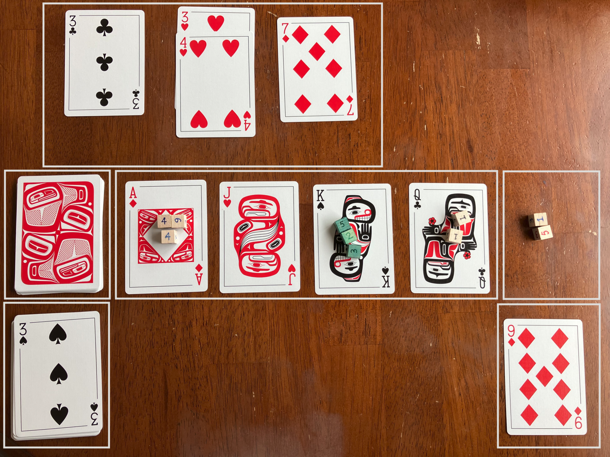

*Much as lumberjacks labor to fell trees and steeplejacks scour at great heights, dungeonjacks delve into the dark and deep places of the world to earn their coin.*

Dungeon Jacks is a simple solitaire dungeon-crawling game that you can play using a deck of cards and some six-sided dice.  Your team of four heroes--a fighter, rogue, wizard, and cleric--must fight their way through several monster encounters to earn treasure and survive until the end of the dungeon!

### Supplies

+ 1 x deck of playing cards
+ 16 x six-sided dice (d6s) - 4 each of four different colors or design.

You will use only 10 of the dice at a time during a single dungeon crawl, but the game is more enjoyable if you can consistently assign the same color dice to the same suit every time you play.

### Setup

Remove any jokers from the deck and set them aside.  They will not be used.

##### Hero Cards

Remove the 16 face cards (J, Q, K, A) from the deck and shuffle them together. From this face-card deck, draw cards until you reveal four cards that are all of a unique rank (J, Q, K, A) and a unique suit (D, H, S, C).  This forms your band of heroes.

> **Example**  
> You draw the Jack of Hearts (JH), which becomes your first hero.  Next, you draw the King of Hearts (KH), but you already have a Hearts card. Next is the Jack of Spades (JS), but you already have a Jack. The next two cards are the Queen of Spades (QS) and the Ace of Clubs (AC), which become your second and third heroes.  Now, the only remaining card that will fit in this party is the King of Diamonds (KD), so you hunt through the rest of the face-card deck to find it.

Each hero's rank determines the size of their dice pool:

| Rank  | # of dice |
| ----- | --------- |
| Jack  | 1         |
| Queen | 2         |
| King  | 3         |
| Ace   | 4         |

Place the corresponding number of dice on each card, using a different color or design for each suit.  For example, I use blue on Diamonds, red on Hearts, green on Spades, and black on Clubs.  The heroes will use their dice, individually or together, to overcome encounters.

Your hero's suit determines their class:

| Suit     | Class   | Description                       | Ability                                                                  |
| -------- | ------- | --------------------------------- | ------------------------------------------------------------------------ |
| Diamonds | Wizard  | A flashy spellcaster              | Can apply 6s against Heart cards and when fleeing                        |
| Hearts   | Cleric  | A healing spellcaster             | Can apply 6s against Heart cards     Can attempt to heal other heroes |
| Spades   | Rogue   | A sneaky backstabbing combatant   | Can reroll 1s vs Spades                                                  |
| Clubs    | Fighter | A burly straightforward combatant | Can reroll 1s vs Clubs                                                   |

The abilities are explained in detail below.

##### Big Bad

Remove the remaining black cards from the face-card deck, shuffle them, and draw one card face-down. This is the Big Bad boss monster you will face in the first dungeon.

Set aside the remainder of the face-card deck.

##### Dungeon Deck

Shuffle the remaining playing cards (2s through 10s) to form the dungeon deck.  Cut this deck roughly in half and shuffle the Big Bad card into the second half of the deck before returning that half to the bottom of the deck.

Place the dungeon deck to one side of your four hero cards.  You will draw cards from this deck to produce each encounter as your heroes descend into the dungeon.

### Playing

Your goal is play through the entire dungeon deck, collecting all the Diamond cards (treasure) that you can.  If you ever lose the dice from all four of your hero cards, you lose.

##### Draw the next encounter

Flip over the top of card of the dungeon deck until you draw a black card (Spades or Clubs). This represents the monster(s) of the next encounter. 

+ Spades represent a single tough monster.
+ Clubs represent a pack or group of smaller monsters. 

The difficulty of the encounter is determined by the rank of the black monster card. Among the Big Bad cards, a Jack counts as 11, Queen as 12, King as 13, and Ace as 14. You will need to roll dice against that difficulty (as explained below).

The other red cards (Hearts and Diamonds) that you flip over before the monster card add detail to the encounter.  

+ Diamonds represent the treasure you can collect if you win this encounter.  
+ Hearts represent additional defenses the monsters have. This might be fortifications, tricks, traps, magic, pets, minions, or something else.  These additional defenses make the encounter harder to overcome than simply facing the monster(s) alone.

Once you have defined the encounter, you can choose to either fight or flee.

##### Fight

Select dice from your heroes to form a pool of dice and then roll it against this encounter. 

+ If any of the dice come up 6, they are **exhausted**. Immediately remove them from the encounter pool and place them off to the side in an exhaustion pool.
+ **Against Clubs:** The Fighter (Clubs hero) is good at wading in against multiple foes. If any of the Fighter's dice come up as 1s while facing a Clubs monster card, you can choose to reroll them. (You might reroll into a 6, though!)
+ **Against Spades:** The Rogue (Spades hero) is good at circling around a single foe to find a weak spot. If any of the Rogue's dice come up as 1s while facing a Spades monster card, you can choose to reroll them. (You might reroll into a 6, though!)
+ **Against Hearts:** If there are any Hearts in the encounter, you can assign up to one die from your rolled encounter pool to each Hearts card. 
	+ If the assigned die is &lt;= the rank of the Hearts card, you have deviously undercut that defense and so it can be ignored.  
	+ If you fail to undercut a Hearts card in this way, add its rank to the monster card, which increases the encounter's difficulty. 
	+ As spellcasters, the Wizard (Diamonds hero) and and Cleric (Hearts hero) have more options available to them when it comes overcoming the unexpected: If one of their dice comes up as a 6, you can assign it to a Hearts card as a 0 value until the encounter is resolved. The die is then exhausted as normal.

Total the remaining dice in the encounter pool. 

* If the total is &gt;= the rank of the monster card (plus any Hearts cards you failed to undercut), you win the encounter. Collect any Diamonds cards into your treasure pile, and discard the rest of the encounter cards into a dungeon discard pile.
* If you fail, you collect none of the treasure and you must Flee (below).  Then discard all the encounter cards.

> **Tip**  
> Whenever you roll against Hearts or use a red hero ability, you're trying to roll low.  Whenever you roll against a black card or use a black hero ability, you're trying to roll high.

##### Fleeing

You can choose to flee from an encounter instead of fighting. If you lose a fight, you must then flee. 

To flee, roll one die taken from any hero card.  You are trying to undercut a 1:

+ On a 6, the die is exhausted without effect. You have not yet escaped, so you must roll another die to flee.
	+ Wizards (Diamonds hero) are particularly good at flashy distractions: If a Wizard die comes up as 6, the die is exhausted but you manage to escape.
+ On a 2 to 5, you escape, but the die is exhausted.
+ On a 1, you miraculously escape with no die lost.

##### Healing

After resolving an encounter (either by winning the fight or by fleeing), the Cleric (Hearts) can attempt to heal any hero who is missing a die.  They can choose to heal themselves with this ability.

Roll one of the Cleric's dice to undercut a 3:

+ On a 3 or less, the target hero recovers one of their dice from the exhaustion pool.
+ On a 4 or 5, nothing happens.
+ On a 6, the Cleric's die is exhausted.

If the Cleric has no dice during this Healing phase, they can instead attempt to recover one through prayer. Roll one of the Cleric's dice in the exhaustion pool.  On a 6, the Cleric recovers it.

##### Next Encounter

Now you can draw the next encounter from the dungeon deck.  

When you reach the end of the dungeon deck, you might draw a number of red cards (Hearts and Diamonds) with no final monster encounter.  This represents the secret doors and hidden treasure that your heroes missed along the way.

##### Losing (TPK)

If, at any time, none of your hero cards have any dice on them, your party is too exhausted to make it out the dungeon.  You suffer a total party kill.

##### Winning

Once you've played through all the encounters in the dungeon deck, total up the value of all your collected treasure (Diamonds) cards.  This is your score for the dungeon.

##### Level Up

If you'd like, you can play again with the same party of heroes. 

* Put your treasure pile back into the dungeon deck.
* Add another Big Bad card to the dungeon deck.  (You don't need to put the Big Bad into the second half of the deck this time.)
* For every 2 Big Bad cards in the deck, add one Diamonds face card (if still available). This represents a magic item. Once collected, you can choose to retain magic items in your treasure pile between dungeons.  At any time, you can expend a magic item from your treasure pile to add a phantom die that counts as a 6 to your encounter pool. Once expended, return the magic item card to the face-card deck.

You can thus play through 6 dungeons of increasing difficulty, with the last dungeon containing 6 Big Bads. Keep a running tally of all treasure earned and magic items retained to determine your party's final score. 

### Sample Layout

+ *Top:* Current encounter
+ *Middle:* Dungeon deck / Hero cards / Exhaustion pool
+ *Bottom:* Dungeon discard pile / Treasure pile
